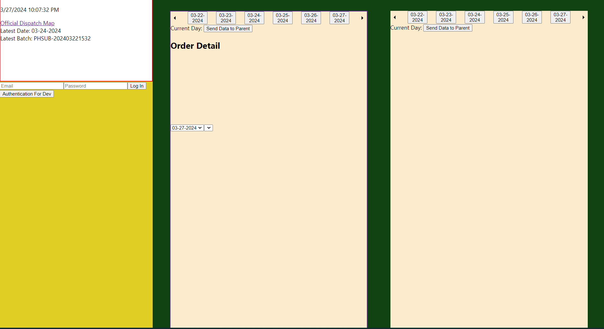
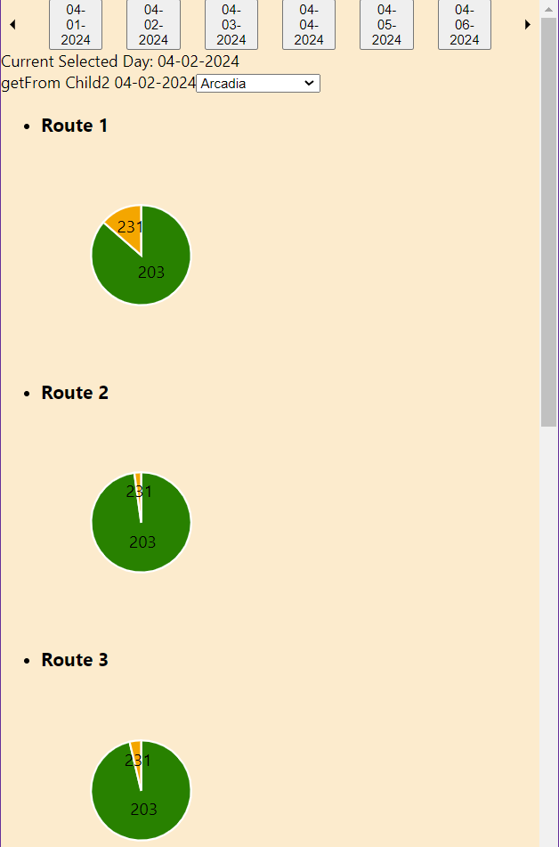
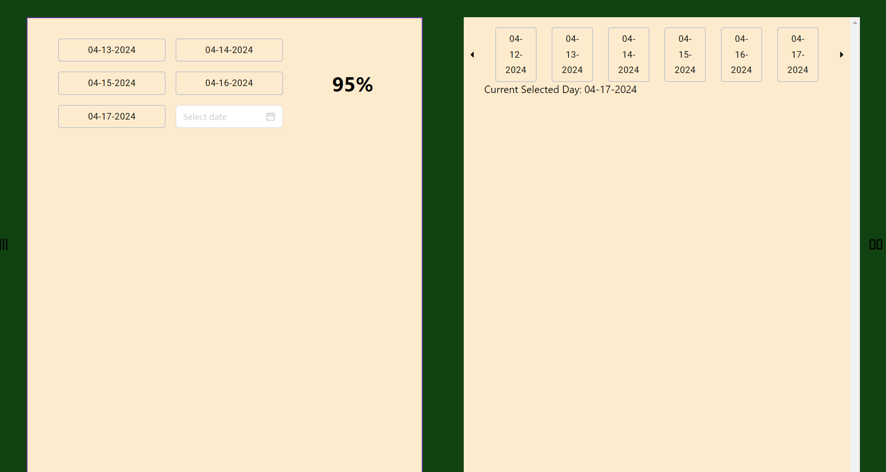
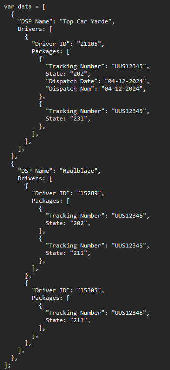
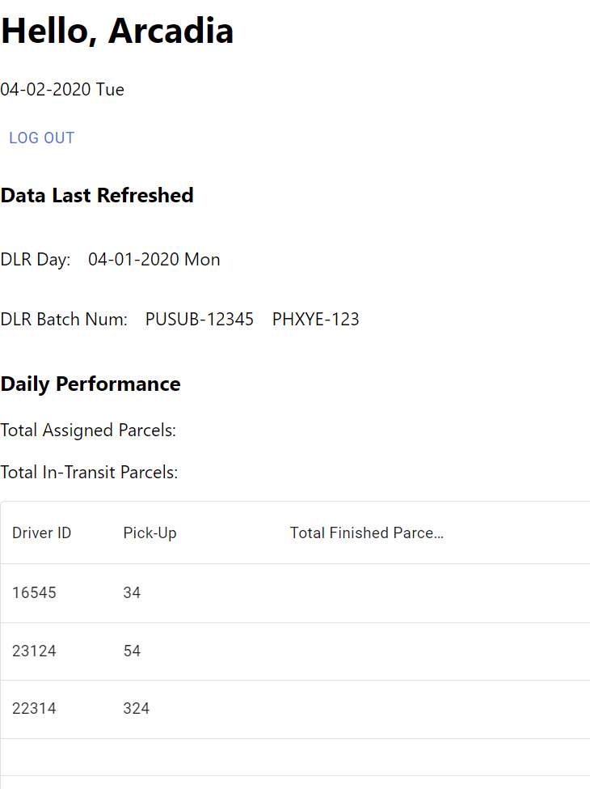
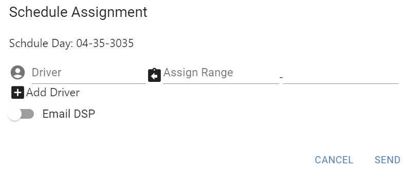
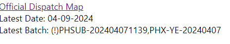

# Porject Name:

- Oasis PHX

# Project Market Backround:

- Logistics
- Quality Assurance
- Global Commerce
- IT consulting

# Project Technical Background:

- Parent system lacks of role-based access control (RBAC) implementation
- Limit input data authorization

# Project Objectives:

- Orchestrating the on-site operation team and service partners
- Optimizing the workflow in the logistic operation
- Outsourced Partners Performance Monitor

# Project created with:

- react: 18.2
- d3: 7.9
- mui: 5.15.14
- antd: 5.16.2
- supabase-js: 2.39

# Project Features (As of 04/18/2024):

- Application Login
- Application Access Control (Administration + A group of Delivery Service Partner)
- Split Screen ✅
- Languages Switch ▪️ ▫️

# Project Log:

## 02/12/2024

- Proof of Concept (POC)
- Testing deployment on Vercel
- Testing data input techniques
  - Local public directory
  - Cloud storage (Google Cloud, Supabase, etc)

02/13/2024 (Deployed on Vercel)

- Set up React Environment
- Multi-pages Establishment

  - Install Router
  - Set up Router
  - Define Route

- Multi-pages Authentication

  - Draw up Authentication context
  - Endpoint prevention

- Date Time Set up
  - Format (MM-dd-YYYY)
  - Time Zone (Mountain Standard Time GMT -8)

02/14/2024

- Working in Access Control
  - Embeded the authentication context
  - Applying <ProtectedRoute/> and <ProtectedRoute_DSP/> to seperate "Authorized/Unauthorized" users

02/15/2024

- Branch navigation routing
- Data conditional display and analysis in the format of XLSX

02/18/2024

- Supabase
  - Set up cloud storage hooks
  - Supabase API Configuration
    - "Update"

03/02/2024

- Supabase
  - Fetch data from supabase cloud storage and display

03/04/2024

(Deployed on Vercel)

- Added enviroment variables in Vercel so client-end will able to connect with Supabase

- Authentication Levels in this proejct

  - Application Access Control (Admin/DSPs)
  - Supabase Session Control
    - Connection Policies set up in supabase
      ! Incomplete, no access for effective Log out. AND the state of session is not interacting with behaviors of the browser.

03/05/24

- User-Input Login
  - To "Admin" Dashboard
  - To start a Supabase Session

03/06/24

- Code Organization in Admin Dashboard

03/07/24

- Duplicated name prevention in Supabase Cloud Storage

  - Somehow spbs.update() is not working for me. Tried:

    1.  ArrayBuffer decode

        - "application/vnd.ms-excel", ContentType in the header is not consistent (ContentType in the request header is correct)

    2.  GetURL with the individual token, though ending up with failed to add "sign/" into PUT request

    - Instead, I applied two asyn functions so they will remove existed file in Supabase Cloud Storage before uploading them.

03/08/24

- Supabase "Upload" + "Inserting" policies

03/09/24

- Data Structure

  - The workflow is designed to when the "Update" action called, the process get execute in which the data will be designed to adapt the format in Supabase tables

03/10/24

- Continue, handling "Insert" action

03/11/24 (Deployed on Vercel)

- Data Structure

  - The workflow of receiving new RD ASMNT

- Update latest day and batch number in the database once get new RD ASMNT
  - current setup:
    1. All B-D 100 days prior to current day will be mapped in database if database is empty
    2. If database is not empty, only update the missing B-D
    3. If first a couple of rows are recorded, the other after them won't get updated.

03/13/2024

- Handle Upload Order List to Supabase Storage

03/14/2024

- Data Structure

  - One BatchNum One Column

- Condition Check
  - If the given value is stored in any columns
  - If the batch in the sheet matches with the reality

03/15/2024

- PostgreSql in Supabase
- Create new tables
- Relative policies setup and active RLS

03/16/2024 -----------

- PostgreSQL function is working on SQL edition in Supabase but not return back to the Application end in react
  so I apply an alternative which simply utilizing "Select()", if the table not existed, specific type of error is thrown, otherwise is it existed

03/17/2024

- Signle Day OrderList Uploading -> Single Day OrderList Table (Unfinished: "If table is existed, remove it + upload new")

03/18/2024

- Signle Day OrderList Uploading -> Single Day OrderList Table

03/19/2024

- Single day dispatch order list display
- Driver DSP sorting

03/20/2024

- Seperate "Display" and "Upload" section

03/23/2024

- Single DSP Single Day
  - "Date" + "DSP" Selection backend

03/25/2025

- Home, Login(Main/DSP) frontend

03/26/2025

- Home, Login(Main/DSP) frontend
- Admin Dsbd frontend

03/27/2024

04/03/2024

- Expand columns for new "rd assignment AZ" in the supabase table

04/04/2024

- Scripts organizaiton (admin dashboard date selection)

04/05/2024

- Fetch data for pie view in the admin dashboard

04/06/2024

- Mapping to the individual DSP pie chart when clicking on the according button
  

- Finished one-day mapping only

04/08/2024

- ...Handle conditions when clicking date button
  - If latest rdAmnt is not include the shown date button
  - If the rdAmnt is not record THIS day
  - Handle the no dispatch day

04/09/2024

- Admin dashboard date selection
  - Seperate conditions (Normal/No dispatch date/No update)
  - Getting start to work on the resizable side bar

04/11/2024

- Admin dashboard sidebar layout and menu button

04/17/2024

- New version of Topbar in the Admin DSBD Performance Panel
  - New Version Modification: Embedded a date picker so user could change range of "previous week" and view according performance history
  - New Version Modification: New section to display the daily digest
    

04-19-2024

- Admin Dashboard

  - Top Bar Utilities UI Design & Development
  - Diaplog pop up when click utility options

- Data Structure for Admin-DSP internal communication

  - 

- DSP
  - Workflow in DSP login access control
    - Data Transition
      ! User Control

04-20-2024

- DSP Main Page (General)
  - Basic UI workflow design
    
  - Dialog
    

**\*\***Endpoint for the deployment is different than the endpoint for the local test

/^&%&^%_&^&\*\*(&(_^&_%_&$$$*&*$$_$&&_^\*))/
!
...Order List Display Features
!"Updated time" in "az rd asmnt" table
!update existed date in the supabase when upload new rd assignment
...Resolve the UI logic
!Check file name, 'order_list','rd asmnt'
!Potential bug: In undispatch day, if today's and tmr's batch num are unfilled
!Bug in updating new daily order list, asynch error in "insertion"

!Login Information Speration
e.g. Block the admin attempt in DSP login page

!Mapping data to the supabase table in "upload new order list"

- If the existed data is different than new comming, update them

!!!Browser Testing

- Chrome working
- Edge not

Emoji Access
https://gist.github.com/roachhd/1f029bd4b50b8a524f3c
